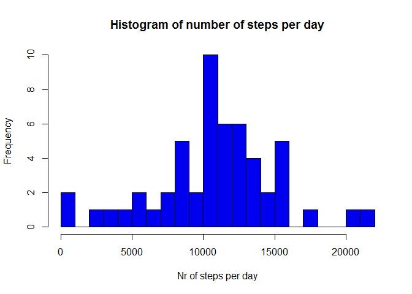
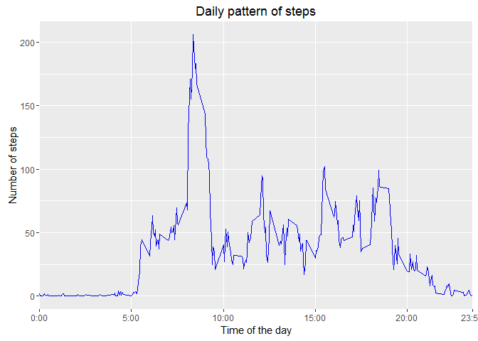
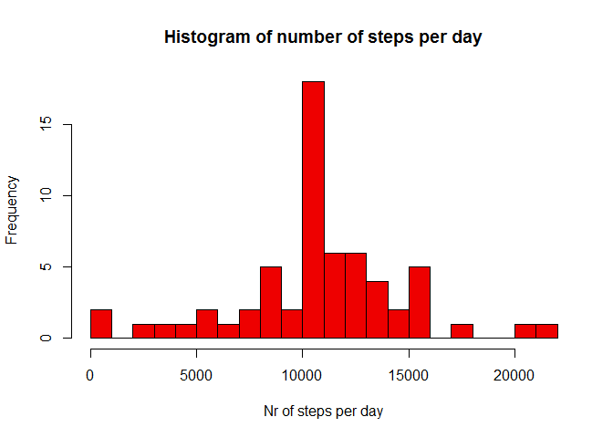
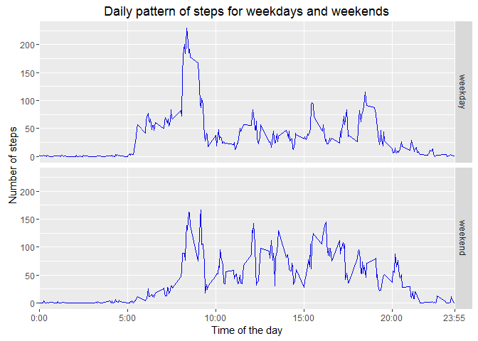
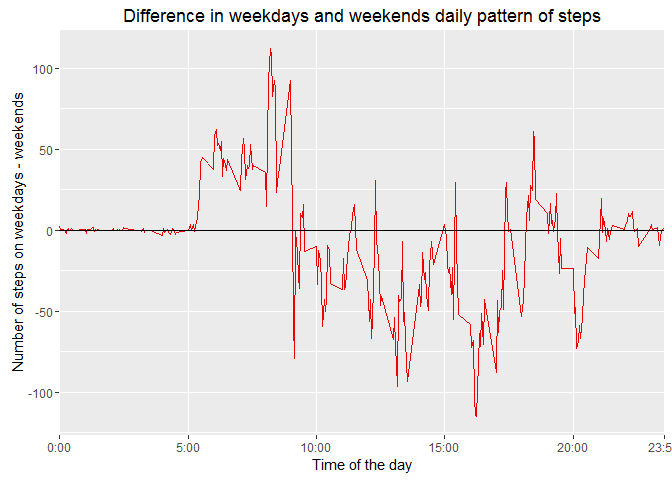

# Analysis of personal movement using activity monitoring devices data
Bela Czeiner  
Saturday, 12 March 2016  

## Loading and preprocessing the data
* Load the data as data fra me
* Convert date to POSIXlt
* Show the structure/format of the data


```r
data <- read.csv("activity.csv", sep = ",", header = TRUE)
data$date <- strptime(data$date, "%Y-%m-%d")
str(data)
```

```
## 'data.frame':	17568 obs. of  3 variables:
##  $ steps   : int  NA NA NA NA NA NA NA NA NA NA ...
##  $ date    : POSIXlt, format: "2012-10-01" "2012-10-01" ...
##  $ interval: int  0 5 10 15 20 25 30 35 40 45 ...
```

## What is mean total number of steps taken per day?
Preparing data for histogram and the mean and median calculations

*Note that the missing values are ignored*

1) Remove missing values and convert date back to POSIXlt


```r
hist_data <- na.omit(data)
steps_per_day <- aggregate(hist_data$steps, by=list(as.character(hist_data$date)), FUN=sum)
colnames(steps_per_day) <- c("date","StepsPerDay")
steps_per_day$date <- strptime(steps_per_day$date, "%Y-%m-%d")
```

2) Show histogram of the total number of steps taken each day


```r
hist(steps_per_day$StepsPerDay,20, col = "blue2", main = "Histogram of number of steps per day", xlab = "Nr of steps per day")
```

 


3) Calculating mean and median of total number of steps taken per day


```r
steps_mean <- as.character(round(mean(steps_per_day$StepsPerDay),3))
steps_median <- median(steps_per_day$StepsPerDay)
```

Mean and median total number of steps taken per day are:

    mean   : 10766.189
    
    median : 10765


## What is the average daily activity pattern?

Make a time series plot (i.e. type = "l") of the 5-minute interval (x-axis) and the average number of steps taken, averaged across all days (y-axis)


```r
library(ggplot2)
daily_pattern <- aggregate(hist_data$steps, by=list(hist_data$interval), FUN=mean)
colnames(daily_pattern) <- c("interval","steps")
ggplot(daily_pattern, aes(interval, steps)) + geom_line(color = "blue2") +
    scale_x_discrete(breaks = c(0,500,1000,1500,2000,2355)
                     , labels=c("0:00","5:00","10:00","15:00","20:00","23:55")) +
    xlab("Time of the day") + ylab("Number of steps") + ggtitle("Daily pattern of steps")
```

 

Which 5-minute interval, on average across all the days in the dataset, contains the maximum number of steps?


```r
top_five <- daily_pattern[which(daily_pattern$steps == max(daily_pattern$steps)),]
top_five_str <- as.character(10000 + top_five$interval)
top_five_str <- strsplit(top_five_str, NULL)
top_five_str <- paste(c(top_five_str[[1]][2:3], ":", top_five_str[[1]][4:5]), collapse='')
```

It is the 08:35


## Imputing missing values

Calculate and report the total number of missing values in the dataset (i.e. the total number of rows with NAs)


```r
# Number of lines with missing_values :
sum(is.na(data$steps)) 
```

```
## [1] 2304
```

```r
# Note that all lines have Dates and Intervals :
sum(is.na(data$date)) 
```

```
## [1] 0
```

```r
sum(is.na(data$interval)) 
```

```
## [1] 0
```

Strategy for filling in all of the missing values in the dataset is to use the mean for the respective 5-minute interval.
The new dataset that is equal to the original dataset but with the missing data filled in is in **data_imputed** variable. (Imputed data is ordered to make comparison easier.)


```r
data_imputed <- merge(data, daily_pattern, by = "interval")
data_imputed <- transform(data_imputed, steps = ifelse(is.na(steps.x),round(steps.y,0),steps.x))
data_imputed <- data_imputed[,c(5,3,1)]
data_imputed <- data_imputed[order(data_imputed$date, data_imputed$interval),]

# check data 

head(data)
```

```
##   steps       date interval
## 1    NA 2012-10-01        0
## 2    NA 2012-10-01        5
## 3    NA 2012-10-01       10
## 4    NA 2012-10-01       15
## 5    NA 2012-10-01       20
## 6    NA 2012-10-01       25
```

```r
head(data_imputed)
```

```
##     steps       date interval
## 1       2 2012-10-01        0
## 63      0 2012-10-01        5
## 128     0 2012-10-01       10
## 205     0 2012-10-01       15
## 264     0 2012-10-01       20
## 327     2 2012-10-01       25
```


Make a histogram of the total number of steps taken each day (using data with imputed values)


```r
steps_per_day_imputed <- aggregate(data_imputed$steps, by=list(as.character(data_imputed$date)), FUN=sum)
colnames(steps_per_day_imputed) <- c("date","StepsPerDay")
steps_per_day_imputed$date <- strptime(steps_per_day_imputed$date, "%Y-%m-%d")

hist(steps_per_day_imputed$StepsPerDay,20, col = "red2", main = "Histogram of number of steps per day", xlab = "Nr of steps per day")
```

 

Calculate and compare the mean and median of total number of steps taken per day before and after imputing missing values


```r
steps_mean_imp <- as.character(round(mean(steps_per_day_imputed$StepsPerDay),3))
steps_median_imp <- as.character(round(median(steps_per_day_imputed$StepsPerDay),3))
```

Mean and median total number of steps taken per day are:

    mean            : 10766.189
    mean imputed    : 10765.639
    
    median          : 10765
    median imputed  : 10762

Questions:
* Do these values differ from the estimates from the first part of the assignment? 
* What is the impact of imputing missing data on the estimates of the total daily number of steps?


```r
summary(steps_per_day)
```

```
##       date                      StepsPerDay   
##  Min.   :2012-10-02 00:00:00   Min.   :   41  
##  1st Qu.:2012-10-16 00:00:00   1st Qu.: 8841  
##  Median :2012-10-29 00:00:00   Median :10765  
##  Mean   :2012-10-30 16:43:01   Mean   :10766  
##  3rd Qu.:2012-11-16 00:00:00   3rd Qu.:13294  
##  Max.   :2012-11-29 00:00:00   Max.   :21194
```

```r
summary(steps_per_day_imputed)
```

```
##       date                      StepsPerDay   
##  Min.   :2012-10-01 00:00:00   Min.   :   41  
##  1st Qu.:2012-10-16 00:00:00   1st Qu.: 9819  
##  Median :2012-10-31 00:00:00   Median :10762  
##  Mean   :2012-10-30 23:32:27   Mean   :10766  
##  3rd Qu.:2012-11-15 00:00:00   3rd Qu.:12811  
##  Max.   :2012-11-30 00:00:00   Max.   :21194
```

Histograms and six number summaries show little difference between the data before and after imouting the missing values. However, as expected the total number os steps increased in the second case as we added more steps.


## Are there differences in activity patterns between weekdays and weekends?

For this part the weekdays() function may be of some help here. Use the dataset with the filled-in missing values for this part.

* New, factor variable created (labelled as "w") with two levels - "weekday" and "weekend" - indicating whether a given date is a weekday or weekend day.
* The following panel plot is creaed using the _facet_ function of _ggpolot_ . It contains a time series plot (line type) of the 5-minute interval (x-axis) and the average number of steps taken, averaged across all weekday days or weekend days (y-axis).


```r
data_imputed.w <- transform(data_imputed
                            , w = as.factor(ifelse(weekdays(data_imputed$date)
                                    %in% c("Saturday","Sunday")
                                    ,"weekend","weekday")))
head(data_imputed)
```

```
##     steps       date interval
## 1       2 2012-10-01        0
## 63      0 2012-10-01        5
## 128     0 2012-10-01       10
## 205     0 2012-10-01       15
## 264     0 2012-10-01       20
## 327     2 2012-10-01       25
```

```r
head(data_imputed.w)
```

```
##     steps       date interval       w
## 1       2 2012-10-01        0 weekday
## 63      0 2012-10-01        5 weekday
## 128     0 2012-10-01       10 weekday
## 205     0 2012-10-01       15 weekday
## 264     0 2012-10-01       20 weekday
## 327     2 2012-10-01       25 weekday
```

```r
daily_pattern_imputed.w <- aggregate(data_imputed.w$steps
            , by=list(data_imputed.w$interval, data_imputed.w$w), FUN=mean)
colnames(daily_pattern_imputed.w) <- c("interval","w","steps")

ggplot(daily_pattern_imputed.w, aes(interval, steps)) + geom_line(color = "blue2") +
    scale_x_discrete(breaks = c(0,500,1000,1500,2000,2355)
                     , labels=c("0:00","5:00","10:00","15:00","20:00","23:55")) +
    xlab("Time of the day") + ylab("Number of steps") + 
    ggtitle("Daily pattern of steps for weekdays and weekends") + 
    facet_grid(w ~ .)
```

 

We can see that in the weekends people start their activities about the same time but with less intensity until about 8am, they are generally walk a bit more during the day and also walk moore in the evenings (after 7pm).

The last plot in 


```r
daily_pattern_wday <- daily_pattern_imputed.w[which(daily_pattern_imputed.w$w == "weekday"),]
daily_pattern_wend <- daily_pattern_imputed.w[which(daily_pattern_imputed.w$w == "weekend"),]

daily_pattern_wday <- daily_pattern_wday[,c(1,3)] 
daily_pattern_wend <- daily_pattern_wend[,c(1,3)]

daily_pattern_diff <- merge(daily_pattern_wday, daily_pattern_wend, by = "interval")
daily_pattern_diff <- transform(daily_pattern_diff, diff = steps.x - steps.y)
colnames(daily_pattern_imputed.w) <- c("interval","w","steps")

ggplot(daily_pattern_diff, aes(interval, diff)) + geom_line(color = "red2") +
    scale_x_discrete(breaks = c(0,500,1000,1500,2000,2355)
                     , labels=c("0:00","5:00","10:00","15:00","20:00","23:55")) +
    xlab("Time of the day") + ylab("Number of steps on weekdays - weekends") + 
    ggtitle("Difference in weekdays and weekends daily pattern of steps") + 
    geom_hline(yintercept = 0)
```

 

The last plot shows the difference between the steps taken on weekdays and weekends. We can clearly see that people walk more in commuter time on weekdays and more in the other parts of a day on weekends.

-- {End of File} ---


